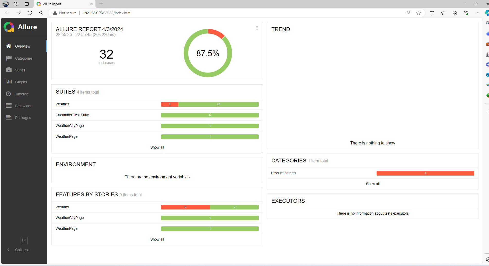

# Prerequisite for project:

Install java and set system variables
Please check more below:
https://maven.apache.org/install.html

Download maven and allure and set system variables
Download allure from here: https://github.com/allure-framework/allure2/releases

Environment: Idea InteliJ Ultimate
Download here: https://www.jetbrains.com/idea/download/?section=windows

### Test are located under following path:
_C:\projects\qa_veisure_test\src\test\resources_

### **In order to execute tests:**

First option:
Execute following command from terminal -
mvn clean test 

Second option:
Execute from test runner class 

Third option
Directly from feature file by triggering run command

### After test execution - Generate Report

In order to generate test report after test execution:
Execute following command line from terminal:
allure serve allure-results 

Example of latest test execution
Tests are split into feature files for api and for ui scenarios

### After execution following issues are notified
1. In case weather condition is drizzle, icon is in jpeg format but expected format is png
2. In case weather temperature  is 10 celsius - Expected [The weather is mild] but found [The weather is cold]
3. In case weather temperature  is [20,24] celsius - Expected [The weather is warm] but found [The weather is ]

### Bonus point cases:

UI project implement under same project as api project - (Can be done as separate project)

Page model object implemented

Since api for checking date and time for city is not free in these cases either we mock call or find another solution (in this case simple helper method)

All helpers methods implemented in common.Utils.java class

